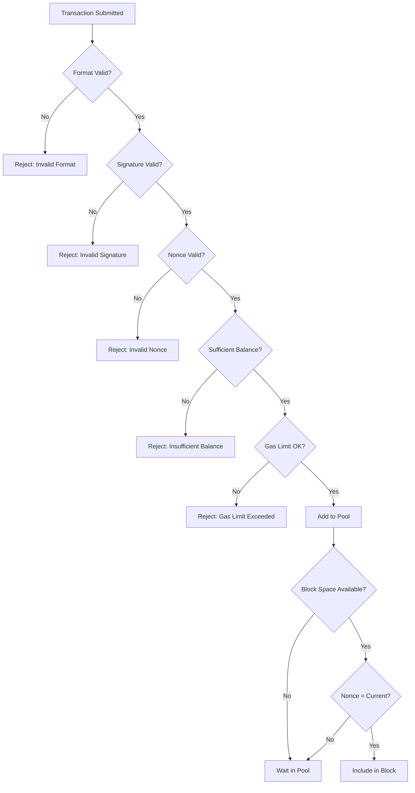

# Transaction Validation

KalyChain validates transactions at multiple stages to ensure only valid transactions are processed and included in blocks.

## Validation Stages

Transactions are validated at three stages:

```
Submit → Pool Validation → Propagation Validation → Block Inclusion Validation
```

### 1. Pool Validation

When a transaction is submitted to the node:

| Check | Description |
|-------|-------------|
| Format | Valid transaction structure and encoding |
| Signature | Valid cryptographic signature |
| Nonce | ≥ account's current nonce |
| Balance | Sufficient for value + maximum gas cost |
| Gas Limit | ≤ block gas limit |
| Gas Price | ≥ minimum configured price |
| Intrinsic Gas | Sufficient gas for transaction type |

### 2. Propagation Validation

When receiving transactions from peers, the node repeats pool validation before adding to its local pool.

### 3. Block Inclusion Validation

When including a transaction in a block:

| Check | Description |
|-------|-------------|
| All pool checks | Re-validated |
| Nonce | Must be exactly `current_nonce` (no gaps) |
| Gas | Transaction gas ≤ remaining block gas |

## Validation Flow



## Nonce Validation

Nonce rules differ by validation stage:

| Stage | Nonce Requirement |
|-------|-------------------|
| Pool Entry | ≥ current account nonce |
| Block Inclusion | = current account nonce (exact match) |

This allows future nonce transactions to wait in the pool while ensuring sequential execution.

### Nonce Gaps

If you submit transactions with nonces 1, 2, and 4 (skipping 3):

- Transactions 1 and 2 execute.
- Transaction 4 waits in pool.
- Transaction 3 must be submitted for 4 to execute.

## Gas Limit Validation

### Block Gas Limit

Each block has a maximum gas capacity. The transaction's gas limit must be less than the remaining block gas:

```
transaction_gas_limit ≤ block_gas_limit - gas_used_by_previous_transactions
```

:::important
The **transaction gas limit** must fit—not the actual gas used. A transaction using 21,000 gas but with a 100,000 gas limit requires 100,000 gas of block space.
:::

### Intrinsic Gas

Minimum gas required for any transaction:

| Component | Gas Cost |
|-----------|----------|
| Base transaction | 21,000 |
| Contract creation | +32,000 |
| Zero data byte | +4 |
| Non-zero data byte | +16 |
| Access list entry | +2,400 per address |
| Access list storage key | +1,900 per key |

## Balance Validation

The account must have sufficient balance for:

```
required_balance = value + (gas_limit × gas_price)
```

For EIP-1559 transactions:

```
required_balance = value + (gas_limit × max_fee_per_gas)
```

The actual cost may be lower, but the maximum must be covered.

## Private Transaction Validation

:::note
Private transactions (for enterprise privacy features) have special handling:

- Privacy marker transactions are submitted to the public pool.
- Private transaction payloads are distributed directly to participants.
- Standard validation applies to marker transactions.
:::

## Error Messages

Common validation errors and solutions:

| Error | Cause | Solution |
|-------|-------|----------|
| `nonce too low` | Nonce already used | Use current nonce |
| `nonce too high` | Gap in nonce sequence | Fill nonce gap |
| `insufficient funds` | Balance < value + gas | Add funds or reduce value |
| `intrinsic gas too low` | Gas limit < minimum | Increase gas limit |
| `exceeds block gas limit` | Gas limit > block capacity | Reduce gas limit |
| `replacement underpriced` | Replacement gas too low | Increase gas price |

## Further Reading

- [Transaction Pool](./pool) — Pool management and prioritization.
- [Transaction Types](./types) — Format-specific validation.
- [Events and Logs](../node-operations/events-and-logs) — Post-execution event handling.
