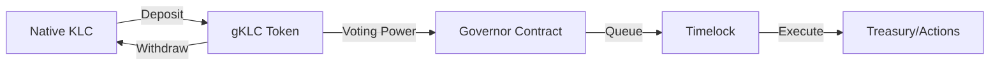

# KalyDAO Overview

**KalyDAO** is the decentralized governance system for KalyChain, enabling on-chain governance using native KLC tokens for voting power.

## How It Works

KalyDAO uses the [OpenZeppelin Governor](https://docs.openzeppelin.com/contracts/4.x/governance) framework with a unique twist: it wraps the **native KLC token** to enable voting, rather than requiring a separate governance token.

## Key Components

| Component | Description | Mainnet Address |
|-----------|-------------|-----------------|
| **Governance Token (gKLC)** | Wrapped KLC with voting power | `0x4BA2369743c4249ea3f6777CaF433c76dBBa657a` |
| **Governor Contract** | Manages proposals and voting | `0xF6C1af62e59D3085f10ac6F782cFDaE23E6352dE` |
| **Timelock Contract** | Security delay for execution | `0xA11572e9724dfeD2BCf8ecc9bfEd18CC609C4c6D` |
| **Treasury Vault** | Governance-controlled funds | `0x92564ec0d22BBd5e3FF978B977CA968e6c7d1c44` |

## Governance Parameters

| Parameter | Value | Description |
|-----------|-------|-------------|
| **Quorum** | 4% | Minimum participation required |
| **Voting Delay** | ~1 week | Time before voting starts (302,400 blocks) |
| **Voting Period** | ~1 week | Duration of voting (604,800 blocks) |
| **Timelock Delay** | 1 hour | Security delay after approval |

## Getting Started

1. **[Get Voting Power](./voting)** — Wrap your KLC to receive gKLC.
2. **[Create a Proposal](./proposals)** — Submit governance proposals.
3. **[View Contracts](./contracts)** — Technical contract details.

## Official DAO Interface

:::tip Live DAO
Access the governance interface at **[dao.kalychain.io](https://dao.kalychain.io)**
:::

## Features

- **Native Token Governance** — Use your KLC directly (wrapped as gKLC)
- **Secure Treasury Management** — Community-controlled funds
- **Transparent Process** — All actions happen on-chain
- **Timelock Security** — Protection against malicious proposals

## Links

- [DAO Interface](https://dao.kalychain.io)
- [Contracts Repository](https://github.com/KalyCoinProject/dao-contracts)
- [Frontend Repository](https://github.com/KalyCoinProject/KalyDAO)
