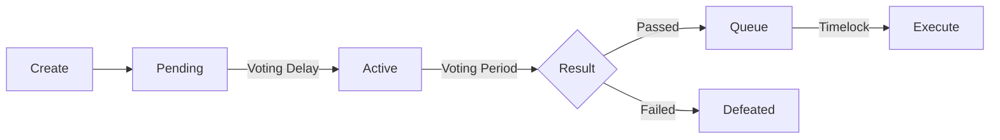

# Creating Proposals

This guide explains how to create and manage governance proposals in KalyDAO.

## Proposal Basics

A proposal is a set of on-chain actions that the community votes to execute. Proposals can:

- Transfer funds from the Treasury
- Modify protocol parameters
- Upgrade contracts
- Execute any on-chain transaction

## Proposal Lifecycle



| Phase | Duration | Description |
|-------|----------|-------------|
| **Pending** | ~1 week | Waiting for voting to start |
| **Active** | ~1 week | Open for voting |
| **Queued** | 1 hour | Timelock security delay |
| **Executable** | — | Ready to execute |

## Creating a Proposal

### Via DAO Interface

1. Go to [dao.kalychain.io](https://dao.kalychain.io)


2. Connect your wallet
3. Click "Create Proposal"
4. Fill in:
   - **Title** — Clear, descriptive name
   - **Description** — Detailed explanation and rationale
   - **Actions** — On-chain calls to execute
5. Submit and sign the transaction

### Proposal Threshold

You need sufficient voting power (gKLC) to create a proposal. Check the current threshold on the DAO interface.

## Writing Good Proposals

### Title

- Be specific: "Allocate 10,000 KLC to Marketing Fund"
- Not vague: "Treasury Proposal"

### Description

Include:

1. **Summary** — What the proposal does
2. **Motivation** — Why it's needed
3. **Specification** — Technical details
4. **Timeline** — Implementation plan (if applicable)
5. **Cost** — Financial impact

### Actions

Each action specifies:

- **Target** — Contract address to call
- **Value** — KLC to send (for payable functions)
- **Calldata** — Encoded function call

Example actions:
- `treasury.transfer(recipient, 1000 KLC)`
- `parameter.setFee(newFee)`
- `contract.upgrade(newImplementation)`

## Proposal States

| State | Description |
|-------|-------------|
| **Pending** | Created, waiting for voting delay |
| **Active** | Voting in progress |
| **Canceled** | Proposer canceled it |
| **Defeated** | Failed to pass (no quorum or more against) |
| **Succeeded** | Passed, ready to queue |
| **Queued** | In timelock waiting period |
| **Expired** | Passed but not executed in time |
| **Executed** | Successfully executed |

## After Your Proposal Passes

### Queue the Proposal

Once voting ends and the proposal passed:

1. Go to the proposal page
2. Click "Queue"
3. Confirm the transaction

This adds the proposal to the Timelock queue.

### Execute the Proposal

After the timelock delay (1 hour):

1. Return to the proposal page
2. Click "Execute"
3. Confirm the transaction

The on-chain actions are now executed.

## Best Practices

1. **Discuss first** — Socialize ideas in the community before formal proposal
2. **Start small** — Test with minor proposals before large changes
3. **Be transparent** — Explain all implications
4. **Include risk analysis** — What could go wrong?
5. **Set realistic timelines** — Account for voting and timelock periods

## Treasury Proposals

The Treasury Vault (`0x92564ec0d22BBd5e3FF978B977CA968e6c7d1c44`) can:

- Hold native KLC
- Hold any ERC20 token
- Send funds via governance proposals

### Example: Transfer from Treasury

To transfer 1,000 KLC from Treasury:

```
Target: 0x92564ec0d22BBd5e3FF978B977CA968e6c7d1c44
Value: 0
Function: transfer(address,uint256)
Args: [recipientAddress, 1000000000000000000000]
```

## Further Reading

- [Voting Guide](./voting) — How to vote on proposals
- [Contract Details](./contracts) — Technical documentation
- [DAO Interface](https://dao.kalychain.io) — Create proposals
